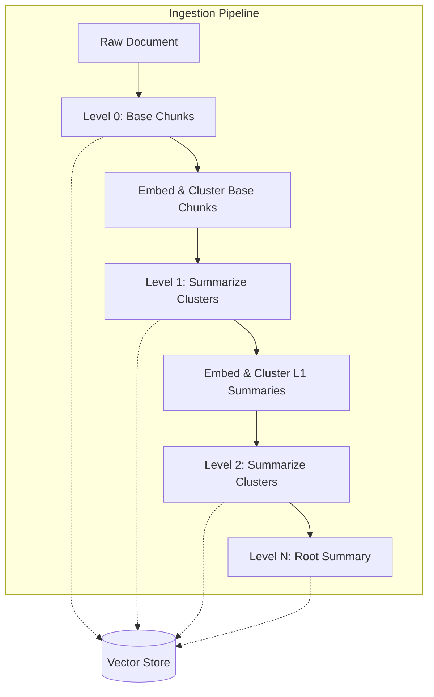
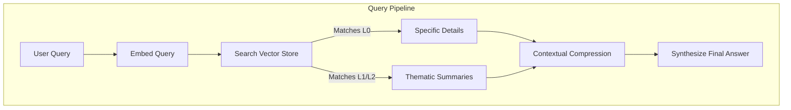

# RAPTOR RAG: Recursive Abstractive Processing and Thematic Organization for Retrieval

Standard Retrieval-Augmented Generation handles direct, fact-seeking questions remarkably well. If you ask a system for a specific data point, retrieving the most similar text chunks works reliably. However, it falters when faced with broad, thematic queries that demand an understanding of the entire document corpus. For these complex queries, looking only at granular, isolated text blocks is insufficient; the system needs a comprehensive overview.

This limitation led to the development of RAPTOR. Rather than choosing between granular details or a massive context window of full documents, RAPTOR builds a hierarchical understanding of the text. It structures information recursively, capturing both the overarching themes and the minute details simultaneously.

## The Theoretical Foundation of RAPTOR

The core idea behind RAPTOR is that documents natively contain hierarchical layers of meaning. A book comprises chapters, chapters contain sections, and sections consist of paragraphs. RAPTOR attempts to model this semantic hierarchy by building a tree-like structure from raw text offline, before any queries are introduced to the system.

The process of constructing this tree operates in an iterative loop:

1. **Base Chunking (Level 0):** The source document is divided into standard overlapping blocks of text. These form the leaf nodes of the tree, capturing highly specific details.
2. **Embedding and Clustering:** The Level 0 chunks are embedded into a vector space. RAPTOR typically uses Gaussian Mixture Models to cluster these embeddings. This approach groups together text chunks that share semantic similarity, organically gathering evidence that relates to the same topic.
3. **Recursive Summarization:** A Large Language Model processes each cluster, generating a condensed, cohesive summary. These summaries become Level 1 of the tree. For instance, ten individual chunks discussing different aspects of a unified topic will merge into one solid summary representing that topic.
4. **Tree Building:** The embedding, clustering, and summarization steps repeat recursively. The Level 1 summaries are embedded, clustered, and summarized to create Level 2. This process continues until the algorithm yields a single root summary or a predefined maximum depth is reached, successfully encapsulating the highest-level themes of the document.

The final tree structure allows the system to house both the highly specific data points at the bottom level and the broader narratives at the higher levels. Once the tree is built, every single node—the original chunks and all synthesized hierarchical summaries—is indexed together into a single flat vector database.



## Creating the RAPTOR Tree

To implement tree building, you need to track each node's level, origin, and embeddings. A simple node data structure can represent each entity clearly. In the implementation below, we iterate over the levels, cluster the current texts, summarize each cluster to generate new higher-level texts, and create relationships.

```python
# A simple representation of an offline RAPTOR tree builder 
for level in range(1, max_levels + 1):
    
    # 1. Embed the texts from the current level
    embeddings = embedder.embed_texts(current_texts)
    
    # 2. Cluster the embeddings using Gaussian Mixture Models
    gmm = GaussianMixture(n_components=n_clusters)
    cluster_labels = gmm.fit_predict(embeddings)
    
    # 3. Summarize each cluster to form the next level
    new_texts = []
    for cluster_id in range(n_clusters):
        cluster_texts = get_texts_for_cluster(current_texts, cluster_labels, cluster_id)
        summary = summarize_with_llm(cluster_texts)
        new_texts.append(summary)
        
    current_texts = new_texts # Propagate summaries to the next iteration
```

## Querying the Structured Tree

With the tree fully constructed, the querying phase leverages a technique known as collapsed tree retrieval. Because all levels of the tree coexist in one searchable space, the system simply embeds the user's query and performs a k-nearest neighbors search across the entire flattened structure simultaneously.

This design naturally aligns the scope of the retrieved answer with the scope of the user's question. A highly specific question will surface Level 0 chunks because their exact phrasing closely matches the query vector. Conversely, a broad, synthesized question will naturally trigger the higher-level summaries, as its vector aligns with broader conceptual representations. This elegantly negates the need to construct a complex query-routing system; the mathematical properties of the vector space handle the routing implicitly.



## Contextual Compression

An important final step in the query pipeline is contextual compression. Searching a large, dense tree often returns multiple sprawling passages spanning different abstraction levels. Passing all this context directly to a generation model can overwhelm its reasoning capabilities and significantly increase token costs. 

To counteract this, RAPTOR passes the retrieved nodes through a secondary extraction stage. An LLM parses the combined context and acts as a strict information filter, stripping out irrelevant sentences and preserving only the exact facts necessary to answer the prompt.

```python
def compress_context(query, retrieved_contexts):
    # Combines contexts and prompts the LLM to extract only relevant facts
    combined = "\n\n---\n\n".join(retrieved_contexts)
    prompt = f"Extract information relevant to '{query}' from:\n{combined}"
    return llm.chat(prompt)
```

The final consolidated facts are then passed to the generative model to synthesize the final answer concisely.

## Implementation Details

A practical implementation of RAPTOR requires robust management of embeddings, clustering logic, and summarization prompts. In a typical setup, systems utilize libraries like FAISS for the vector index, OpenAI for embeddings and content generation, and scikit-learn for Gaussian Mixture clustering.

The architecture manages the offline ingestion process by recursively tracking nodes. A dedicated node data structure groups text objects, assigning them hierarchical levels and tracking parent-child relationships, giving the developer absolute visibility into how an abstract theme was derived from its source material. 

Using Gaussian Mixture Models over simpler algorithms like K-Means ensures that the clusters adapt naturally to the distribution density of the semantic space, preventing rigid, unnatural grouping. During querying, the retrieved context seamlessly flows through the compression extraction chain before generation, guaranteeing maximum precision in the final output.

## Final Considerations

RAPTOR significantly advances how architectures parse and comprehend large, complex texts. While the computational overhead during ingestion is undeniably high—requiring repeated embeddings and generation calls—the resulting indexed domain can answer both macro and micro queries with remarkable accuracy. It effectively eliminates the context-fragmentation problem inherent to flat vector storage systems, transforming disjointed chunks back into a cohesive, structured knowledge base.
